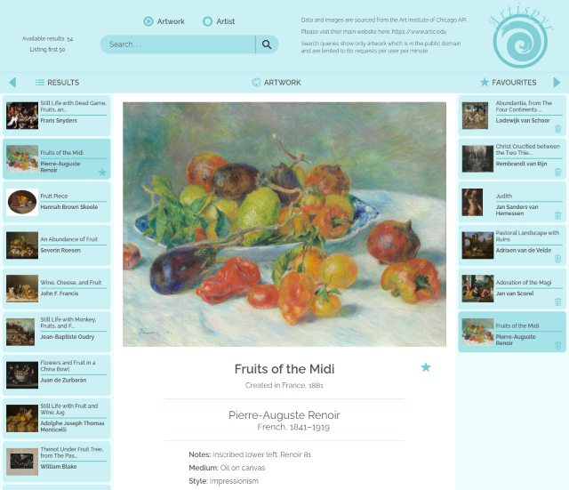

# Artispyr

This is a website interface to the Art Institute of Chicago API to search for artworks or artists. Results are shown in a paginated listing and the user can choose an image to view - this will then be shown in the main section with its details. Bookmarking can be done by making it a 'favourite'.

The project is currently live and can be viewed [here](https://artispyr.netlify.app).

## Preview

## Requirements

The following npm packages were used in the development:

- parcel: 2.0.0-nightly.776
- @parcel/transformer-image: 2.0.0-nightly.2400
- @parcel/transformer-sass: 2.0.0-nightly.778
- core-js: 3.15.2
- regenerator-runtime: 0.13.7

Nightly builds of parcel were used to see if the issue of using SVGs was fixed - please see explanation in Parcel section of Technologies below.

## How to Set Up

- First run `npm install` to install dependencies from package.json.
- `npm start` will then launch the development server running on localhost.
- `npm run build` prepares the project for production.

## Motivation

The focus of this project was on Javascript, the interaction with an API and handling asynchronous code. This gave a chance to practice using MVC architecture in Javascript with classes, inheritance and design patterns - e.g. publisher-subscriber.

## API

The Art Institute of Chicago API is used to query, obtain details on artworks matching the query and are in the public domain. Further details are [here](https://api.artic.edu/docs). This is an open API and hot-linking images on their image server is allowed.

Huge thanks to the Art Institute of Chicago, as I think their API is awesome!

## Technologies

### Javascript

Modern Javascript (vanilla only) was mainly used to create a fluid user experience on the webpage. There are a number of views implemented and I tried to make things concise. Views are the following:

- artwork: main section showing the large image and details of the item. This is divided into the artworkImage and artworkDetails.
- results/favourites: column listing having essentially the same code but displaying different data.
- resultsSummary: total number of available results. The amount obtained is capped at 50 to prevent excessive use.
- artworkListing: an item in the results and favourites listing, which is kind of a child to the results and favourites.
- pagination: this is given to the results and favourites to cycle through the listing pages.
- search: this is the form for the user search.
- View: parent class for rendering.
- MessageView: parent class with messages and extends View.
- sectionHeadings: used to control buttons to show/hide results and favourites.
- mediaQueries: javascript media queries.

Other files are:

- model: the data interaction with the API and storage (holding a state and localStorage is used to persist favourites).
- controller: controller in MVC.
- helpers: helper functions.
- noResultsReceivedError/userInputError: custom errors.
- config: settings for the application.

### API Queries

Queries were made through minified URL encoded JSON with Elasticsearch syntax.

### Scss

CSS was organised with Scss. There was less of an emphasis with CSS on this project, as the concentration was on Javascript.

### Parcel

As seen in the package.json, Parcel was used in the development. Building currently does not work with SVGs due to a 3rd party package causing an error in minifying, so '--no-optimize' has to be used at the moment.

## Key Features

- Search artworks and artists on the Art Institute of Chicago API, which are part of the public domain.

- View paginated results and store favourites in a paginated listing, if it gets long enough.

- Javascript powered.

## To Do

- Support older browsers

## License

Copyright © 2021 Adam Crombie.

This project is [MIT](./LICENSE.txt) licensed.
